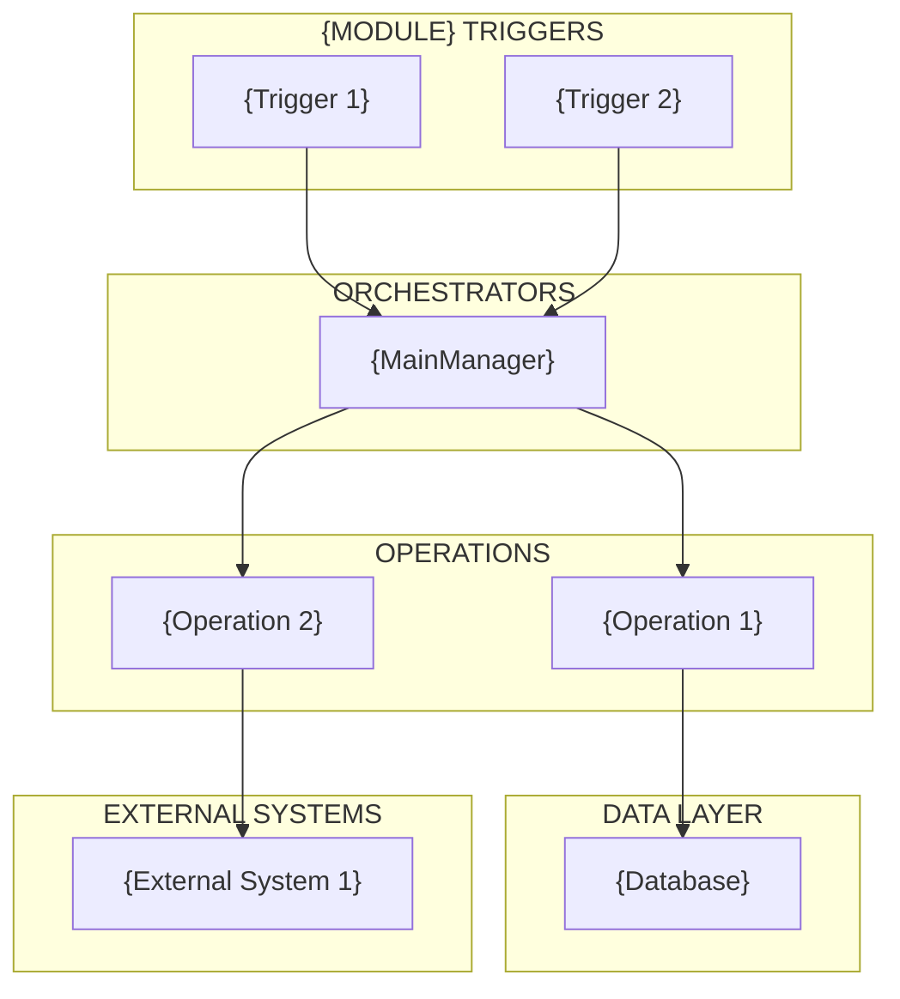

# {Module Name} Architecture

> **Notion Table of Contents**: After importing this document to Notion, add a Table of Contents block for easy navigation:
> 1. Type `/table` in Notion and select "Table of contents"
> 2. The ToC block will automatically track all 13 sections (H2 headers) in this document
> 3. Click any section in the ToC to jump directly to it
> 4. The ToC updates automatically when you add, remove, or rename sections

---

## Overview

{Brief description of the module's purpose and main capabilities}

- **{Capability 1}**: {Description}
- **{Capability 2}**: {Description}

---

## When Does {Action} Happen?

### Automatic Triggers

| Trigger | What Happens |
|---------|--------------|
| **{Event name}** | {Description of behavior} |
| **{Event name}** | {Description of behavior} |

### User-Initiated Triggers

| Trigger | What Happens |
|---------|--------------|
| **{User action}** | {Description of behavior} |
| **{User action}** | {Description of behavior} |

---

## Execution Order

When {main operation} runs, the following sequence occurs:

1. **{Step name}** - {Description}
2. **{Step name}** - {Description}
3. **{Step name}** - {Description}

---

## What Gets {Processed/Synced/Handled}

**{Direction/Category 1}:**
- {Item 1}
- {Item 2}

**{Direction/Category 2}:**
- {Item 1}
- {Item 2}

---

## Architecture Diagram



---

## Key Components

### 1. {ComponentName}

**Location**: `{path}/{ComponentName}.swift`

{Brief description of what this component does}

| {Attribute Type} | {Purpose Column} |
| --- | --- |
| `{name}` | {Description} |
| `{name}` | {Description} |

**Key Methods**:

- `{methodName}()` - {Description}
- `{methodName}()` - {Description}

### 2. {ComponentName}

**Location**: `{path}/{ComponentName}.swift`

{Brief description}

| {Manager/Handler} | {Data Types/Responsibility} |
| --- | --- |
| `{Name}` | {Description} |
| `{Name}` | {Description} |

### 3. {ConfigurationStruct} (if applicable)

Configuration struct for controlling behavior:

```swift
struct {ConfigName} {
    let {property}: {Type}     // {Comment}
    let {property}: {Type}     // {Comment}
}
```

**Usage**: {How this config is used}

---

## {Main Operation} Flows

### {Flow Name} Flow

Triggered by: {trigger conditions}

```
1. {Class}.{method}()
2. → {next step}()
3.   → {nested step}()
4.     → {leaf operation}
```

### {Flow Name} Flow

**Key behavior**:

- {Important behavior 1}
- {Important behavior 2}

---

## Data Mappings (if applicable)

| App Data Type | External Type | Unit/Format |
| --- | --- | --- |
| {Internal} | {External} | {Unit} |
| {Internal} | {External} | {Unit} |

---

## Configuration / Feature Flags

| Flag/Config | Purpose |
| --- | --- |
| `{flagName}` | {What it controls} |
| `{configKey}` | {What it controls} |

---

## Error Handling

Errors are tracked via `{ErrorType}` and monitored through {monitoring system}:

```swift
struct {ErrorType}: {Protocol} {
    var type: String        // {comment}
    var message: String?    // {comment}
}
```

---

## Notifications / Events

| Notification | Purpose |
| --- | --- |
| `.{notificationName}` | {When posted and what it signals} |
| `.{notificationName}` | {When posted and what it signals} |

---

## User Type / Mode Variations (if applicable)

### {User Type 1}

- {Behavior description}
- {Behavior description}

### {User Type 2}

- {Behavior description}
- {Behavior description}

---

## Related Documentation

- {Related Module}
- ADR-{N}: {Decision Title}

---

*Generated by BMAD Corporate — Doris (Documentation Specialist)*
*{AUTO:date}*
