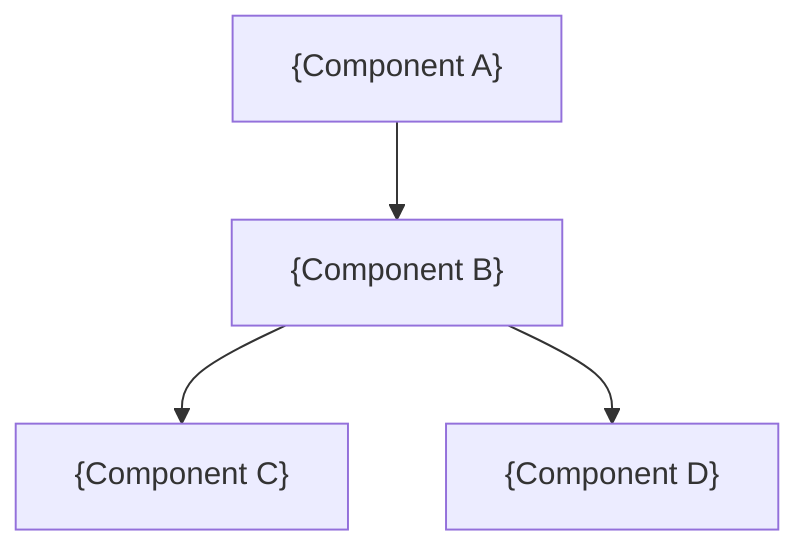

# Architecture: {System/Feature Name}

## System Overview

{2-3 sentences describing the system at a high level}

## Component Architecture

### {Component Name}
- **Responsibility**: {What it does}
- **Dependencies**: {What it depends on}
- **Interface**: {Key public APIs}

### {Component Name}
- **Responsibility**: {What it does}
- **Dependencies**: {What it depends on}
- **Interface**: {Key public APIs}

## Architecture Decision Records

### ADR-001: {Decision Title}

**Status**: Proposed
**Context**: {Why this decision is necessary}
**Decision**: {What we decided}
**Alternatives Considered**:
- Option A: {Description} — Pros: {}, Cons: {}
- Option B: {Description} — Pros: {}, Cons: {}
**Consequences**: {Impact on the system}

## Technology Stack

| Layer | Technology | Justification |
|---|---|---|
| {Layer} | {Technology} | {Why this choice} |

## Data Model

{Entity descriptions and relationships}

## Concurrency & Threading

{Threading model, async patterns, actor usage}

## Error Handling Strategy

{How errors are propagated, logged, and surfaced to users}

## Security Considerations

{Authentication, authorization, data protection}

## Performance & Scalability

{Performance targets, scaling approach, known bottlenecks}
